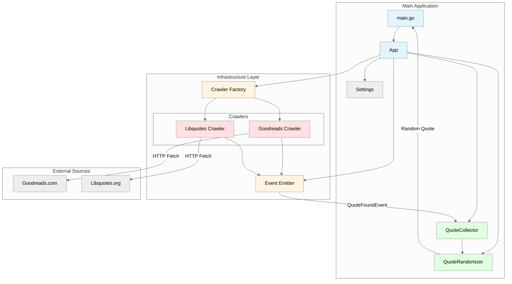

## Random Quote

Fetch a random quote.

This project is a sample setup for fetching book quotes from few sources and displaying a random one. At this point it has no persistence and can be run in a few ways eg:
- directly as a Go app with `go run ./...`
- via docker:
  ```bash
  docker build -t random-quote:latest .
  docker run --rm random-quote
  ```
  
- via Kubernetes (Cron)Job by:
  ```bash
  TOOLS_PATH= make cluster-up
  TOOLS_PATH= tilt up
  ```

Project is a sample wire up for development with tilt and kind. Initially there was an attempt to wire up kind custer bootstrap within Tiltfile but this was abandoned as the approach is cumbersome and not a standard one.

## Architecture




## Dependencies

To run this application via `tilt` you need few dependencies on the system:
- docker
- kind
- ctlptl
- helm
- tilt